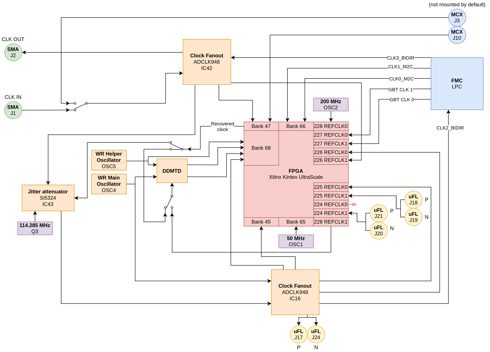

.. _metlino_clocking:

Clocking
========

This section describes how and where clock signals are routed. Switches symbolize connections that can be altered by placement of capacitors. Default connection is symbolized by switch position.

FPGA Oscillators
----------------

* OSC1 - 50 MHz main clock source for FPGA resources
* OSC2 - 200 MHz clock for MGT

Clock distribution
------------------

Metlino cards recover their DRTIO clock from their SFP/SATA transciever link. DRTIO documentation is `here <https://m-labs.hk/artiq/manual/drtio.html>`__.

