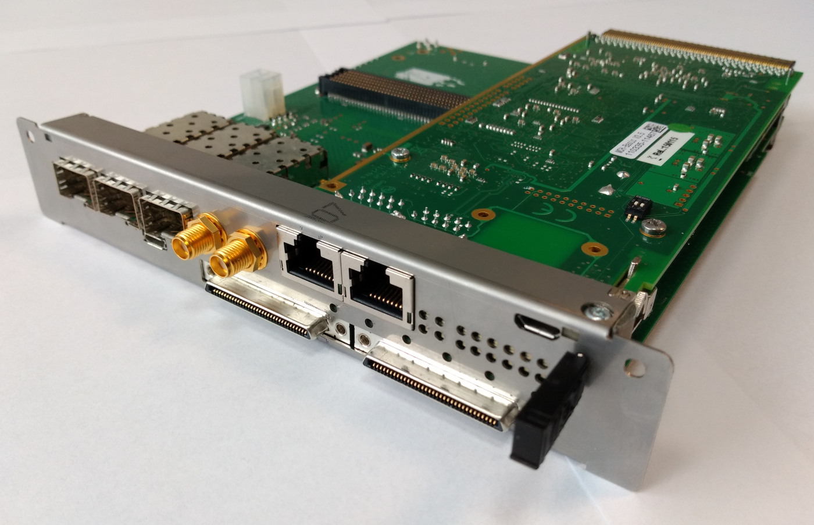

Project description
===================

Metlino is an extension for a MCH which provides an FPGA with connection to each AMC module in the crate through MCH tongue 3. It also provides an FMC LPC slot and two VHDCI connectors. Metlino is designed to work with NAT MCH v3.5.

.. note:: Make sure to check if daughterboard connector is mounted on your MCH.

    Metlino (bottom) attached to the MCH (top)

Functional specifications
-------------------------

Programmable resources:
^^^^^^^^^^^^^^^^^^^^^^^

* Xilinx Kintex UltraScale FPGA - XCKU040-1FFVA-1156C

    * speed grade: -1
    * 20 GTH transceivers (Max Preformance 16.3 Gb/s)

* Managment CPU: LPC17762984

Memory:
^^^^^^^

* 2GB  DDR3 SDRAM with 64-bit interface and 800 MHz clock
* SPI Flash for FPGA configuration.
* SPI Flash for user data storage
* EEPROM with MAC and unique ID 

Connectivity:
^^^^^^^^^^^^^

* 1 low pin count (LPC) FMC slot for single width mezzanine card
* Micro-USB providing:

    * JTAG
    * FPGA UART
    * CPU UART and DFU

* Stand-alone 12 V power connector
* MGT (Multi-Gigabit Transceiver) connected to:

    * Backplane x12
    * FMC x4 (optionally x5 if alt port 0 is not used)
    * Port 0 (usually Ethernet from MCH, additionally this link is also connected to SATA port)
    * SFP x3

* VHDCI connector x2 compatible with `VHDCI Carrier <https://github.com/sinara-hw/vhdci_carrier>`_

Optional connections can be made by resoldering capacitors on PCB. 

Power supply:
^^^^^^^^^^^^^

* Monitoring of voltage and Power supply for FMC 12 V
* FMC VADJ fixed to 1,8 V
* Monitoring current of all FMC buses
* Stand-alone power connector

Clocking:
^^^^^^^^^

* Si5324 - clock recovery and jitter attenuator
* SMA CLK input and output (front panel)
* MCX CLK input x2 (see :ref:`metlino_clocking`)

Other:
^^^^^^

* Temperature, voltage and current monitoring for critical power buses
* Temperature monitoring: FMC, supply, FPGA core, DDR memory
* JTAG multiplexer for FMC access, local JTAG port and USB JTAG
* Optional Ethernet RGMII PHY for Port 0

