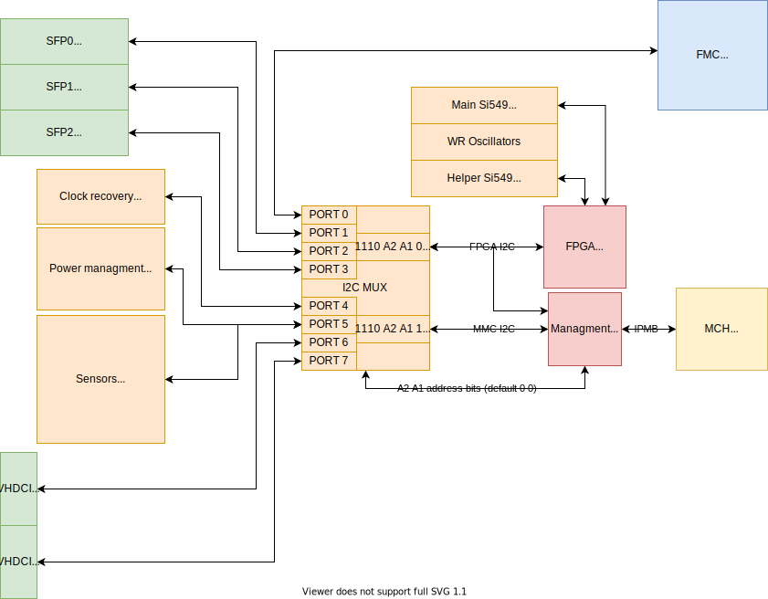

.. _metlino_i2c:

I2C connections
===============

The I2C MUX is made from two TCA9548 I2C multiplexers. In Metlino there are two main I2C buses: MMC\_I2C and FPGA\_I2C. Each of them is connected to one multiplexer. Outputs are tied together, so masters (Managment CPU and FPGA) can access to any of 8 I2C buses. Addidtionaly Managment CPU has access to FPGA\_I2C and is connected to IPMB through MCH Daughterboard connector.

    I2C map with addresses in hex

