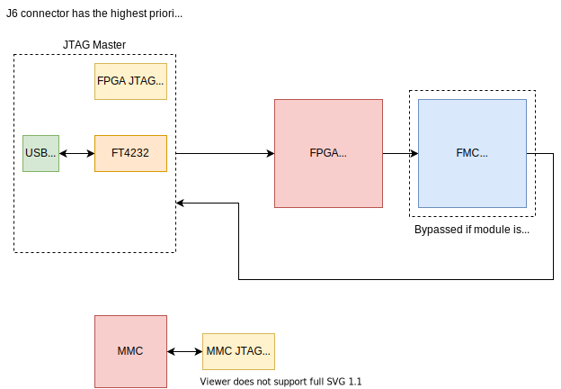
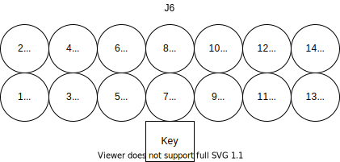
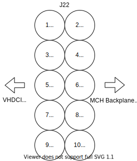

.. _metlino_jtag_section:

JTAG
====

    JTAG chain

On Metlino there are two JTAG sources:

* USB to JTAG bridge (FTDI chip) 
* onboard JTAG connector (Xilinx type, keyed) - J6

If USB cable is connected then ``USB_JTAG_ACTIVE`` line is pulled high which enables USB JTAG access.
Insertion of JTAG programmer (more specifically grounding of ``EN_USB_JTAG`` line, pin 13 on J6) deactivates the FTDI JTAG connectivity.

Each of JTAG slave devices is connected in chain. Devices from FMC can be inserted into the chain based on the presence signal.

.. _metlino_jtag_pinout:

JTAG connectors pinout
----------------------

    FPGA JTAG - J6

    MMC JTAG connector - J22, in position as in PCB
