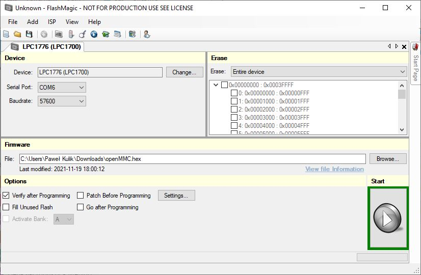
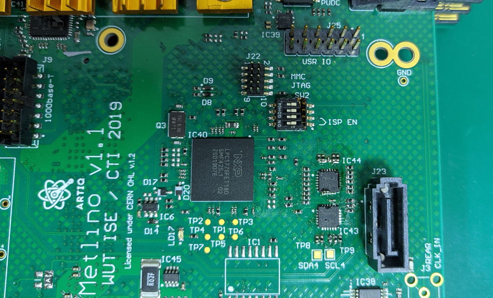

.. _metlino_cpu:

Managment CPU
=============

Managment CPU configures and manages various aspects of Metlino to operate correctly in MicroTCA crate. Its main tasks are:

* communication with the MCH,
* negotiating payload power,
* enabling various on-board power supplies,
* monitoring stability of on-board power supplies,
* managing hotswap abilities,
* supplying sensor information via IPMB.

Managment CPU boot
------------------

During boot Managment CPU performs several tasks:

* configures CPU, UART from own FLASH
* sets IO port directions
* configures I2C switch base address for master ports - MMC, FPGA
* communicates with MCH and asks for payload power if hotswap handle is inserted
* enables power supplies in sequence described in power supply section

.. note::
	Configuration of CPU, UART does not affect any of LED indicators.

Compiling firmware
------------------

Source code of OpenMMC is located `here <https://github.com/sinara-hw/openmmc/tree/sayma-devel>`_.

Cmake
^^^^^

Compiling under Linux using cmake toolchain is the preferred option.
Clone or download git repository. Then:

::

	mkdir build && cd build
	cmake ../ -DBOARD=metlino -DTARGET_CONTROLLER=LPC1776 -DCMAKE_BUILD_TYPE=Debug
	make

Minimal Dockerfile which downloads and compiles firmware:

::

	FROM ubuntu:20.04

	RUN DEBIAN_FRONTEND=noninteractive apt-get update && \
		DEBIAN_FRONTEND=noninteractive apt-get upgrade -y && \
		DEBIAN_FRONTEND=noninteractive apt-get install -y gcc-arm-none-eabi cmake git

	RUN git clone https://github.com/sinara-hw/openMMC.git && \
		cd openMMC && git checkout sayma-devel
	
	ENV CC="arm-none-eabi-gcc"
	ENV CXX="arm-none-eabi-g++"

	RUN cd openMMC && mkdir build && cd build && \ 
		cmake ../ -DBOARD=metlino -DTARGET_CONTROLLER=LPC1776 -DCMAKE_BUILD_TYPE=Debug \
		 -DCMAKE_C_COMPILER_WORKS=1 -DCMAKE_CXX_COMPILER_WORKS=1 && \
		make

	ENTRYPOINT ["/bin/bash"]

You can use it as a reference to configure your system for compilation.

MCUXpresso
^^^^^^^^^^

Follow steps in :ref:`mcuxpresso2` and substitute source repository.

Flashing firmware
-----------------

Header flashing
^^^^^^^^^^^^^^^

The CPU can be upgraded by USB cable and NXP programmer (can be used other programmer but make sure that header shorts pins 3, 5, 9) using LPCXpresso/MCUXpresso, `Flashmagic <http://www.flashmagictool.com/>`_ or any other software which can talk with NXP bootloader. The tested programmer is LPCLink V2. Flashing using programmer also allows to debug the CPU. Use ``openMMC.axf`` file for flashing with LPCXpresso/MCUXpresso.

1. Disable power on Metlino
2. Disconnect programmer from USB
3. Connect ribbon cable

	Connection of programmer to the board

4. Enable power on Metlino
5. Connect programmer to USB
6. Flash
7. Select LPC_LINK2
8. Default flash driver = LPC177x_8x_407x_8x_256.cfx (select from file system), reset handling default, flash reset handling default

.. figure:: ../sayma_amc/img/openmmc-flash.png

9. Run
10. Disconnect programmer from USB
11. Disable power on Metlino
12. Disconnect ribbon

USB flashing
^^^^^^^^^^^^

SW2 switch can be used to enable ISP mode of managment processor. Enabling first and second switch allows to program the processor using USB. Enabling last switch allows to run the board outside of the crate.
See :ref:`metlino_overview` for the location of the header (top view, call-out 16).

Run command ``arm-none-eabi-objcopy -I binary -O ihex /path/to/openMMC.bin /path/to/openMMC.hex``

The CPU can be upgraded using USB and flashmagic software. This option only allows to flash IC, without any debug option.

Steps to flash using USB:

	* Set SW2 first and second switches to "ON" position on Metlino

	Switch positions for USB programming

	* Set LPC1776
	* Select last serial port that appears after connecting Metlino via USB
	* Select baud 57600
	* Select enitre device for erase
	* Select hex file you generated earlier
	* Enable verify after programming
	* Press start

	Flashmagic settings

	* Set SW2 switches to their original positions after flashing is done

	Switch positions for normal operation

On linux tools such as `mxli <http://www.windscooting.com/softy/mxli.html>`_ can be used to program Managment CPU.

