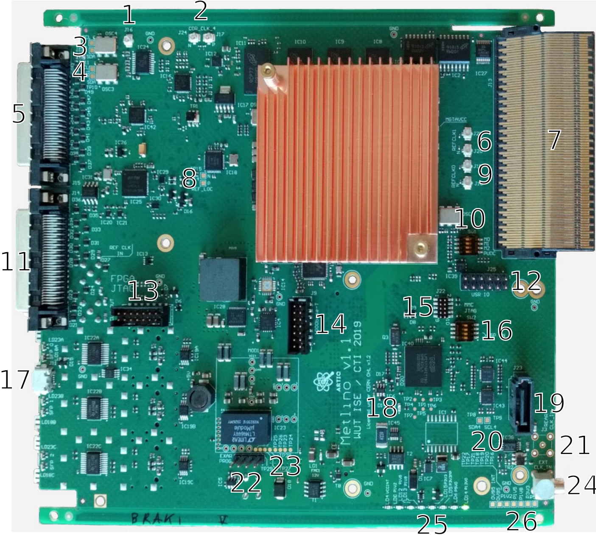

.. _metlino_overview:

Board overview
==============

    Front view
    
+----+-------------------+-------------------------------------------------+
| #  | Item name         | Description                                     |
+====+===================+=================================================+
| 1  | SFP2              | SFP connector                                   |
+----+-------------------+-------------------------------------------------+
| 2  | SFP2 LEDs         | Connected to the FPGA                           |
+----+-------------------+-------------------------------------------------+
| 3  | SFP1              | SFP connector                                   |
+----+-------------------+-------------------------------------------------+
| 4  | SFP1 LEDs         | Connected to the FPGA                           |
+----+-------------------+-------------------------------------------------+
| 5  | SFP0              | SFP connector                                   |
+----+-------------------+-------------------------------------------------+
| 6  | Micro USB port    | See :ref:`metlino_usb_uart`.                    |
+----+-------------------+-------------------------------------------------+
| 7  | SMA clock output  | J2 SMA connector (see :ref:`metlino_clocking`)  |
+----+-------------------+-------------------------------------------------+
| 8  | SMA clock input   | J1 SMA connector (see :ref:`metlino_clocking`)  |
+----+-------------------+-------------------------------------------------+
| 9  | VHDCI Connector   | J14 - connected to the FPGA (VHDCI0)            |
+----+-------------------+-------------------------------------------------+
| 10 | VHDCI Connector   | J15 - connected to the FPGA (VHDCI1)            |
+----+-------------------+-------------------------------------------------+
| 11 | Blue LED          | Indicates hot-swap state.                       |
+----+-------------------+-------------------------------------------------+
| 12 | Green LED         | Indicates Managment CPU activity.               |
+----+-------------------+-------------------------------------------------+
| 13 | FPGA Done LED     | Indicates that the FPGA is programmed.          |
+----+-------------------+-------------------------------------------------+
| 14 | ETH PHY LED1      | Connected to Ethernet PHY (Activity).           |
+----+-------------------+-------------------------------------------------+
| 15 | ETH PHY LED0      | Connected to Ethernet PHY (LINK).               |
+----+-------------------+-------------------------------------------------+
| 16 | ETH PHY LED2      | Connected to Ethernet PHY (MDIO INT).           |
+----+-------------------+-------------------------------------------------+

+--------+------------------------+-------------------------+-------------------------+
| LED    | On                     | Blinking                | Off                     |
+========+========================+=========================+=========================+
| Blue   | Ready for hot-swap     | Preparing for hot-swap  | Not ready for hot-swap  |
+--------+------------------------+-------------------------+-------------------------+
| Red    | Power supply error     | N/A                     | Power supply ok         |
+--------+------------------------+-------------------------+-------------------------+
| Green  | MMC failure            | Normal operation        | MMC failure             |
+--------+------------------------+-------------------------+-------------------------+

    Top view

+----+-------------------------+--------------------------------------------------------------------+
| #  | Item name               | Description                                                        |
+====+=========================+====================================================================+
| 1  | u.FL connector          | WR helper oscillator output (N/C by default)                       |
+----+-------------------------+--------------------------------------------------------------------+
| 2  | u.FL connectors         | Clock fanout (IC16) output                                         |
+----+-------------------------+--------------------------------------------------------------------+
| 3  | WR I2C testpoints       | Testpoints of WR Helper (OSC4) oscillator I2C bus.                 |
+----+-------------------------+--------------------------------------------------------------------+
| 4  | WR I2C testpoints       | Testpoints of WR Main (OSC3) oscillator I2C bus.                   |
+----+-------------------------+--------------------------------------------------------------------+
| 5  | VHDCI Connector         | J15 - connected to the FPGA (VHDCI1)                               |
+----+-------------------------+--------------------------------------------------------------------+
| 6  | u.FL connectors         | FPGA MGT bank 224 REFCLK 1 (see :ref:`metlino_clocking`).          |
+----+-------------------------+--------------------------------------------------------------------+
| 7  | MCH connector           | Connected to tongue 3 & 4                                          |
+----+-------------------------+--------------------------------------------------------------------+
| 8  | Clock testpoints        | Testpoints of Si5324 (IC18) clock output                           |
+----+-------------------------+--------------------------------------------------------------------+
| 9  | u.FL connectors         | FPGA MGT bank 225 REFCLK 1 (see :ref:`metlino_clocking`).          |
+----+-------------------------+--------------------------------------------------------------------+
| 10 | FPGA mode switch        | See :ref:`metlino_fpga_mode_sw`.                                   |
+----+-------------------------+--------------------------------------------------------------------+
| 11 | VHDCI Connector         | J14 - connected to the FPGA (VHDCI1)                               |
+----+-------------------------+--------------------------------------------------------------------+
| 12 | GPIO header             | Connected to the FPGA. See :ref:`metlino_headers` for pinout.      |
+----+-------------------------+--------------------------------------------------------------------+
| 13 | FPGA JTAG port          | See :ref:`metlino_jtag_pinout` for pinout.                         |
+----+-------------------------+--------------------------------------------------------------------+
| 14 | Ethernet header         | Connected to Ethernet PHY. See :ref:`metlino_headers` for pinout.  |
+----+-------------------------+--------------------------------------------------------------------+
| 15 | CPU JTAG port           | See :ref:`metlino_jtag_pinout` for pinout.                         |
+----+-------------------------+--------------------------------------------------------------------+
| 16 | CPU switch              | Controls CPU operation and upgrade (see :ref:`metlino_cpu`).       |
+----+-------------------------+--------------------------------------------------------------------+
| 17 | Micro USB port          | See :ref:`metlino_usb_uart`.                                       |
+----+-------------------------+--------------------------------------------------------------------+
| 18 | CPU LED                 | Indicates CPU power supply                                         |
+----+-------------------------+--------------------------------------------------------------------+
| 19 | SATA port               | J23 (see :ref:`metlino_transceiver_connections`)                   |
+----+-------------------------+--------------------------------------------------------------------+
| 20 | I2C testpoints          | Connected to 4th bus (see :ref:`metlino_i2c`).                     |
+----+-------------------------+--------------------------------------------------------------------+
| 21 | MCX clock input         | Alternative to J1 clock input (see :ref:`metlino_clocking`).       |
+----+-------------------------+--------------------------------------------------------------------+
| 22 | Exar programmer header  | Header used for programming an optional Exar power module          |
+----+-------------------------+--------------------------------------------------------------------+
| 23 | Power module pins       | Pins for an alternative power module with Exar chip.               |
+----+-------------------------+--------------------------------------------------------------------+
| 24 | MCX clock input         | J10 - connected to the FPGA (see :ref:`metlino_clocking`).         |
+----+-------------------------+--------------------------------------------------------------------+
| 25 | Power supply LEDs       | Indicate state of various power supplies.                          |
+----+-------------------------+--------------------------------------------------------------------+
| 26 | Power testpoints        | Testpoints connected to various power supplies                     |
+----+-------------------------+--------------------------------------------------------------------+

    Bottom view

+----+------------------------------+----------------------------------------------------------------------------+
| #  | Item name                    | Description                                                                |
+====+==============================+============================================================================+
| 1  | MCH daughterboard connector  | Connects to the MCH                                                        |
+----+------------------------------+----------------------------------------------------------------------------+
| 2  | SMA clock input              | J1 SMA connector (see :ref:`metlino_clocking`)                             |
+----+------------------------------+----------------------------------------------------------------------------+
| 3  | SMA clock output             | J2 SMA connector (see :ref:`metlino_clocking`)                             |
+----+------------------------------+----------------------------------------------------------------------------+
| 4  | FMC connector                | Used to connect FMC LPC board. See :ref:`metlino_FMC_section` for pinout.  |
+----+------------------------------+----------------------------------------------------------------------------+
| 5  | SFP0                         | SFP connector                                                              |
+----+------------------------------+----------------------------------------------------------------------------+
| 6  | SFP1                         | SFP connector                                                              |
+----+------------------------------+----------------------------------------------------------------------------+
| 7  | SFP2                         | SFP connector                                                              |
+----+------------------------------+----------------------------------------------------------------------------+
| 8  | Power port                   | J5 (see :ref:`metlino_pwr` for pinout)                                     |
+----+------------------------------+----------------------------------------------------------------------------+

.. _metlino_headers:

Headers pinout
--------------

    GPIO header - call-out 12 on top view

    Ethernet 1000Base-T header - call-out 14 on top view

.. _metlino_fpga_mode_sw:

FPGA boot mode switch
---------------------

SW1 is used to chose configuration mode of the FPGA. Configuration modes define the specifics of how the FPGA will interact with the data source or external control logic. SW1 is tied directly to Bank 0 of the FPGA. All pins have pull ups, switching SW1 connects the signal to ground. See `UltraScale Architecture Configuration User Guide <https://www.xilinx.com/support/documentation/user_guides/ug570-ultrascale-configuration.pdf>`_ for more information.

+-----+-----+-----+-----------------------+
| M0  | M1  | M2  | Description           |
+=====+=====+=====+=======================+
| 0   | 0   | 0   | Master Serial Mode    |
+-----+-----+-----+-----------------------+
| 0   | 0   | 1   | Master Parallel Up    |
+-----+-----+-----+-----------------------+
| 0   | 1   | 1   | Master Parallel Down  |
+-----+-----+-----+-----------------------+
| 1   | 0   | 1   | Peripheral mode       |
+-----+-----+-----+-----------------------+
| 1   | 1   | 1   | Slave Serial mode     |
+-----+-----+-----+-----------------------+
