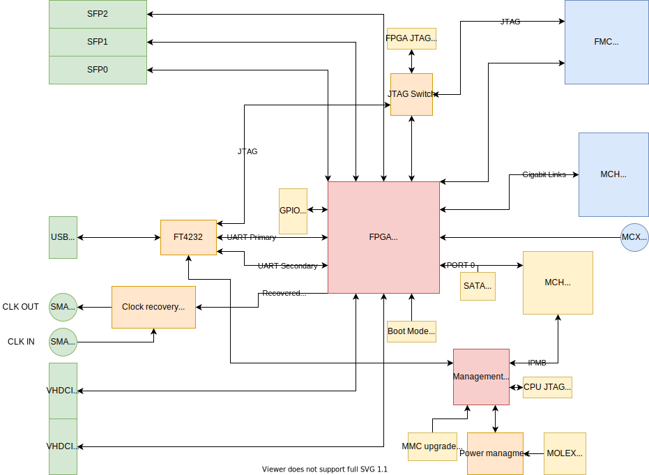
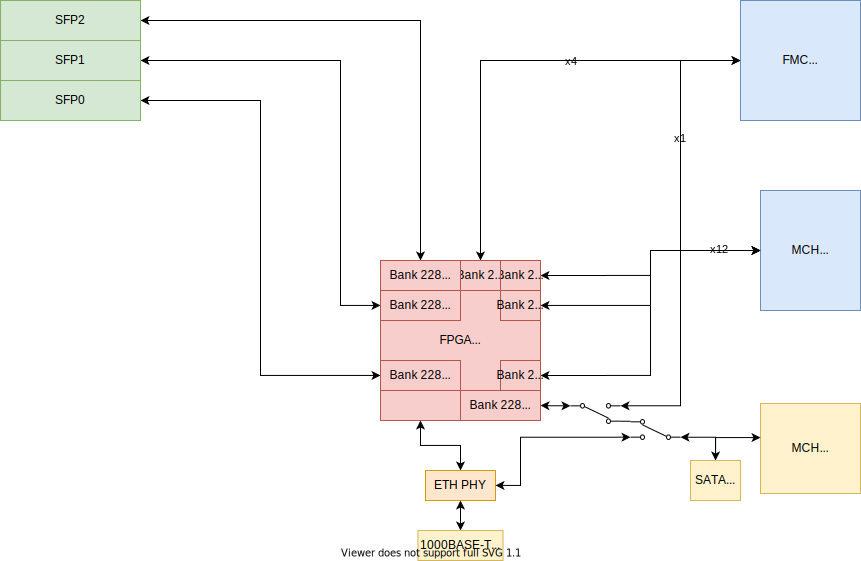

Routing
=======

This section contain block schematics of Metlino board.

.. _metlino_io_connections:

I/O connections
---------------

General block schematic below shows simplified connections between I/O and components. Some unused connectors were left out to improve readability of this schematic. Front panel connectors (green) and back connectors (blue) are arranged in the same order as in the PCB.

    General block schematic

.. _metlino_transceiver_connections:

Transceiver connections
-----------------------

Block schematic below shows connections to Multi-Gigabit Transceivers (MGT) of the FPGA. Switches symbolize connections that can be altered by placement of capacitors. Default connection is symbolized by switch position.

    MGT schematic with optional connections

Table below outlines connections to MGT ports of the FPGA. If there are two possibilities then the default one is listed first. All connections are routed in both direction. `MCH Fabric D 1` connects to Port 4 of AMC in slot #1 when Metlino is placed in main (usually left) MCH slot and Port 8 when placed in redundant (usually right) MCH slot. `MCH Farbic D 2` connects to Port 4 of AMC in slot #2 etc.

+------------------+---------------------+
| Transceiver      | Routed to           |
+==================+=====================+
| 0\_224           | MCH Fabric D 1      |
+------------------+---------------------+
| 1\_224           | MCH Fabric D 7      |
+------------------+---------------------+
| 2\_224           | MCH Fabric D 2      |
+------------------+---------------------+
| 3\_224           | MCH Fabric D 8      |
+------------------+---------------------+
| 0\_225           | MCH Fabric D 3      |
+------------------+---------------------+
| 1\_225           | MCH Fabric D 9      |
+------------------+---------------------+
| 2\_225           | MCH Fabric D 4      |
+------------------+---------------------+
| 3\_225           | MCH Fabric D 10     |
+------------------+---------------------+
| 0\_226           | MCH Fabric D 5      |
+------------------+---------------------+
| 1\_226           | MCH Fabric D 11     |
+------------------+---------------------+
| 2\_226           | MCH Fabric D 6      |
+------------------+---------------------+
| 3\_226           | MCH Fabric D 12     |
+------------------+---------------------+
| 0\_227           | FMC DP 0            |
+------------------+---------------------+
| 1\_227           | FMC DP 1            |
+------------------+---------------------+
| 2\_227           | FMC DP 2            |
+------------------+---------------------+
| 3\_227           | FMC DP 3            |
+------------------+---------------------+
| 0\_228           | SFP2                |
+------------------+---------------------+
| 1\_228           | SFP0                |
+------------------+---------------------+
| 2\_228           | SFP1                |
+------------------+---------------------+
| 3\_228           | Port 0 or FMC DP 4  |
+------------------+---------------------+

