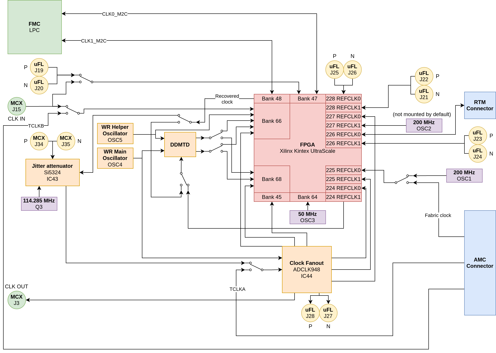

Clocking
========

This section describes how and where clock signals are routed. Switches symbolize connections that can be altered by placement of capacitors. Default connection is symbolized by switch position.

FPGA Oscillators
----------------

* OSC1 - 200 MHz clock for MGT
* OSC2 - 200 MHz clock for MGT (not mounted by default)
* OSC3 - 50MHz main clock source for FPGA resources

