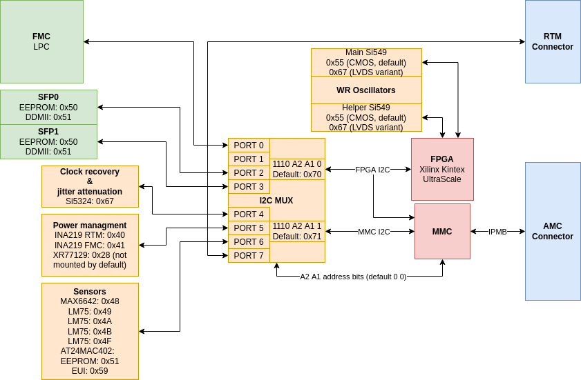

I2C connections
===============

The I2C MUX is made from two TCA9548 I2C multiplexers. In Sayma AMC there are two main I2C busses: MMC\_I2C and FPGA\_I2C. Each of them is connected to one multiplexer. Outputs are tied together, so masters (MMC and FPGA) can access to any of 7 I2C busses. Addidtionaly MMC has access to FPGA\_I2C and is connected to IPMB through AMC connector.

    I2C map with addresses in hex

.. todo:: Add a table with designator, part number, mux port, address and short description of the part.
