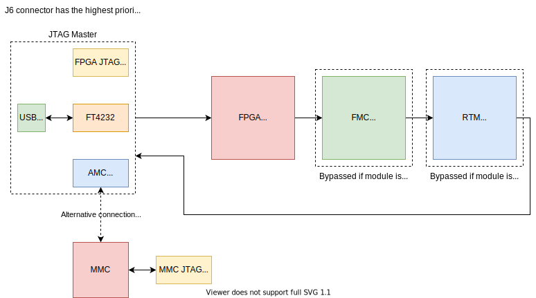
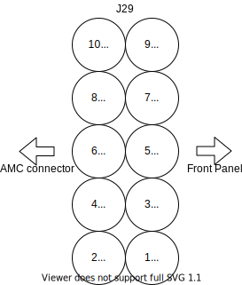

.. _jtag_section:

JTAG
====

    JTAG chain

On Sayma AMC there are three JTAG sources:

* AMC connector (JSM module)
* USB to JTAG bridge (FTDI chip) 
* onboard JTAG connector (Xilinx type, keyed) - J6

By default AMC port is selected as master.
If USB cable is connected then ``USB_JTAG_ACTIVE`` line is pulled high which disables AMC port and enables USB JTAG access.
Insertion of JTAG programmer (more specifically grounding of ``EN_USB_JTAG`` line, pin 13 on J6) deactivates the FTDI JTAG connectivity.

Each of JTAG slave devices is connected in chain. Devices from FMC and RTM modules can be inserted into the chain based on their presence signal.

MMC has a separate JTAG connector J29, which is connected to AMC connector JTAG when:

* payload supply is switched off and management supply is on,
* JTAG programmer is not connected to J6
* and USB cable is not connected.

.. _amc_jtag_pinout:

JTAG connectors pinout
----------------------

    FPGA JTAG - J6

    MMC JTAG connector - J29, in position as in PCB
