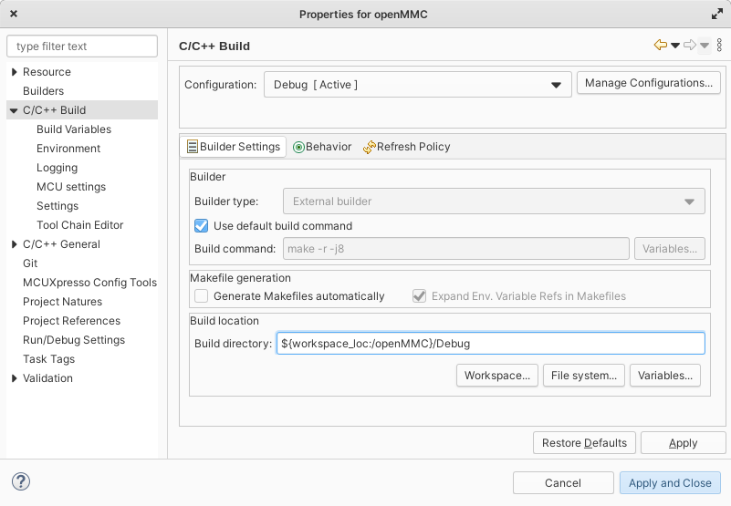

.. _mmc:

MMC
===

MMC is a CPU which configures and manages various aspects of Sayma AMC to operate correctly in MicroTCA crate. Its main tasks are:

* communication with MCH,
* negotiating payload power,
* enabling various on-board power supplies,
* monitoring stability of on-board power supplies,
* managing hotswap abilities,
* supplying sensor information via IPMB.

MMC boot
--------

During boot MMC performs several tasks:

* configures CPU, UART from own FLASH
* sets IO port directions
* configures I2C switch base address for master ports - MMC, FPGA
* communicates with MCH and asks for payload power if hotswap handle is inserted
* enables power supplies in sequence described in power supply section
* checks if RTM is inserted, if yes, then enables its power

.. note::
	Configuration of CPU, UART does not affect any of LED indicators.

Compiling firmware
------------------

Source code of OpenMMC is located `here <https://github.com/sinara-hw/openmmc/tree/sayma-devel>`_. Currently "sayma-devel" branch is used.

Cmake
^^^^^

Compiling under Linux using cmake toolchain is the preferred option.
Clone or download git repository and checkout ``sayma-devel`` branch. Then:

::

	mkdir build && cd build
	cmake ../ -DBOARD=sayma -DBOARD_RTM=sayma -DTARGET_CONTROLLER=LPC1776 -DCMAKE_BUILD_TYPE=Debug
	make

Minimal Dockerfile which downloads and compiles firmware:

::

	FROM ubuntu:20.04

	RUN DEBIAN_FRONTEND=noninteractive apt-get update && \
		DEBIAN_FRONTEND=noninteractive apt-get upgrade -y && \
		DEBIAN_FRONTEND=noninteractive apt-get install -y gcc-arm-none-eabi cmake git

	RUN git clone https://github.com/sinara-hw/openMMC.git && \
		cd openMMC && git checkout sayma-devel
	
	ENV CC="arm-none-eabi-gcc"
	ENV CXX="arm-none-eabi-g++"

	RUN cd openMMC && mkdir build && cd build && \ 
		cmake ../ -DBOARD=sayma -DBOARD_RTM=sayma -DTARGET_CONTROLLER=LPC1776 \
			-DCMAKE_BUILD_TYPE=Debug -DCMAKE_C_COMPILER_WORKS=1 \
			-DCMAKE_CXX_COMPILER_WORKS=1 && \
		make

	ENTRYPOINT ["/bin/bash"]

You can use it as a reference to configure your system for compilation.

.. _mcuxpresso2:

MCUXpresso
^^^^^^^^^^

To compile binaries newest version of `MCUXpresso <https://www.nxp.com/design/software/development-software/mcuxpresso-software-and-tools-/mcuxpresso-integrated-development-environment-ide:MCUXpresso-IDE>`_ is needed. Also install cmake from `Cmake website <https://cmake.org/download/>`_ if using windows or from your package manager if using Linux.

Steps to import and compile project in MCUXpresso are shown below. Version 11.4.0 was used.

1. From menu choose "File" -> "Import"
2. Choose "Git" -> "Projects from Git"

3. Select "Clone URI"

4. Paste address of OpenMMC repository

5. Select only ``sayma-devel`` branch

6. Select directory where to store project

7. Import using the new project wizard

8. Select C/C++ -> Makefile Project with existing code

9. Select toolchain "NXP MCU Tools", Only set "C" in languages, select existing code location to one you specified earlier

10. Click ``Finish``.
11. Right-click project in project explorer -> Properties
12. Select C/C++ build -> select build location (e.g ``${workspace_loc:/openMMC}/Debug``)

13. Select C/C++ build -> MCU settings -> select LPC1776 in "preinstalled MCUs"

14. Click ``Apply and Close`` button.
15. Open ``Debug`` folder in console (create it in project folder if needed) and run ``cmake ../ -DBOARD=sayma -DBOARD_RTM=sayma -DTARGET_CONTROLLER=LPC1776 -DCMAKE_BUILD_TYPE=Debug``

::

	pawel@WI-3-14:/tmp/openMMC$ mkdir Debug
	pawel@WI-3-14:/tmp/openMMC$ cd Debug
	pawel@WI-3-14:/tmp/openMMC/Debug$ cmake ../ -DBOARD=sayma -DBOARD_RTM=sayma -DTARGET_CONTROLLER=LPC1776 -DCMAKE_BUILD_TYPE=Debug
	-- The C compiler identification is GNU 9.3.0
	-- The CXX compiler identification is GNU 9.3.0
	-- The ASM compiler identification is GNU
	-- Found assembler: /usr/bin/cc
	-- Check for working C compiler: /usr/bin/cc
	-- Check for working C compiler: /usr/bin/cc -- works
	-- Detecting C compiler ABI info
	-- Detecting C compiler ABI info - done
	-- Detecting C compile features
	-- Detecting C compile features - done
	-- Check for working CXX compiler: /usr/bin/c++
	-- Check for working CXX compiler: /usr/bin/c++ -- works
	-- Detecting CXX compiler ABI info
	-- Detecting CXX compiler ABI info - done
	-- Detecting CXX compile features
	-- Detecting CXX compile features - done
	CMake Warning at CMakeLists.txt:21 (message):
	  No toolchain configuration file specified.  Using default option!

	-- Build type: Debug
	-- Selected Board: sayma
	-- Selected RTM Board support: sayma
	-- Selected Controller: LPC1776
	-- Selected modules to compile: FRU;PAYLOAD;SDR;WATCHDOG;FPGA_SPI;HOTSWAP_SENSOR;EEPROM_AT24MAC;EEPROM_24XX64;LM75;MAX6642;ADT7420;INA219;RTM;UART_DEBUG;SENSORS;CLI;CUSTOM;PCF8574;ADT7420
	-- Selected debug probe: LPCLink
	CMake Warning at probe/lpclink.cmake:33 (message):
	  crt_emu_cm3_nxp not found! Can't program the controller!
	Call Stack (most recent call first):
	  CMakeLists.txt:130 (include)

	-- Configuring done
	-- Generating done
	-- Build files have been written to: /tmp/openMMC/Debug

16. Build project in MCUXpresso

Flashing firmware
-----------------

Header flashing
^^^^^^^^^^^^^^^

The MMC can be upgraded by USB cable and NXP programmer (can be used other programmer but make sure that header shorts pins 3, 5, 9) using LPCXpresso/MCUXpresso, `Flashmagic <http://www.flashmagictool.com/>`_ or any other software which can talk with NXP bootloader. The tested programmer is LPCLink V2. Flashing using programmer also allows to debug the CPU. Use ``openMMC.axf`` file for flashing with LPCXpresso/MCUXpresso.

1. Disable power on AMC
2. Disconnect programmer from USB
3. Connect ribbon cable

	Connection of programmer to the board

4. Enable power on AMC
5. Connect programmer to USB
6. Flash
7. Select LPC_LINK2
8. Default flash driver = LPC177x_8x_407x_8x_256.cfx (select from file system), reset handling default, flash reset handling default

9. Run
10. Disconnect programmer from USB
11. Disable power on AMC
12. Disconnect ribbon

USB flashing
^^^^^^^^^^^^

SW2 switch can be used to enable ISP mode of MMC processor. Enabling first and second switch allows to program the processor using USB. Enabling last switch allows to run the board outside of the crate.
See :ref:`amc_overview` for the location of the header (bottom view, call-out 1).

Run command ``arm-none-eabi-objcopy -I binary -O ihex /path/to/openMMC.bin /path/to/openMMC.hex``

The MMC can be upgraded using USB and flashmagic software. This option only allows to flash IC, without any debug option.

Steps to flash using USB:

	* Set serial console 115200 8n1
	* Press front-panel button PB3 to trigger MMC to dump to serial console
	* Set SW2 first and second switches to "ON" position on Sayma AMC

	Switch positions for USB programming

	* Set LPC1776
	* Select last serial port that appears after connecting Sayma via USB
	* Select baud 57600
	* Select enitre device for erase
	* Select hex file you generated earlier
	* Enable verify after programming
	* Press start

.. figure:: img/flashmagic.JPG

	Flashmagic settings

	* Set SW2 switches to their original positions after flashing is done

	Switch positions for normal operation

On linux tools such as `mxli <http://www.windscooting.com/softy/mxli.html>`_ can be used to program MMC.

AMC connector flashing
^^^^^^^^^^^^^^^^^^^^^^

JTAG lines of MMC are connected to AMC JTAG if no programmer is present and payload power is switched off (see :ref:`jtag_section` section), so it should be possible to program MMC with JTAG Switch Module. However this wasn't verified in practice.

Ethernet
--------

Unlike in Sayma v1.0, MMC does not have access to Ethernet.

