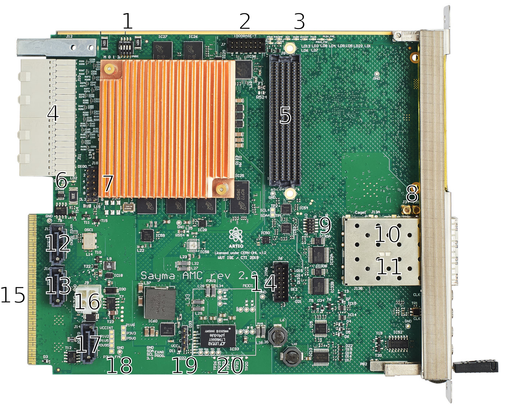

.. _amc_overview:

Board overview
==============

    Front view
    
+----+-------------------+----------------------------------------------------+
| #  | Item name         | Description                                        |
+====+===================+====================================================+
| 1  | Hotswap handle    | Handle used to disable and pull out the module.    |
+----+-------------------+----------------------------------------------------+
| 2  | Blue LED          | Indicates hot-swap state.                          |
+----+-------------------+----------------------------------------------------+
| 3  | MCX I/O           | J1  MCX connector (see :ref:`amc_io_connections`)  |
+----+-------------------+----------------------------------------------------+
| 4  | MCX I/O           | J2 MCX connector (see :ref:`amc_io_connections`)   |
+----+-------------------+----------------------------------------------------+
| 5  | MCX clock input   | J15 MCX connector (see :ref:`amc_clocking`)        |
+----+-------------------+----------------------------------------------------+
| 6  | MCX clock output  | J3 MCX connector (see :ref:`amc_clocking`)         |
+----+-------------------+----------------------------------------------------+
| 7  | SFP1              | SFP connector                                      |
+----+-------------------+----------------------------------------------------+
| 8  | SFP1 LED 2        | Connected to the FPGA                              |
+----+-------------------+----------------------------------------------------+
| 9  | SFP1 LED 1        | Connected to the FPGA                              |
+----+-------------------+----------------------------------------------------+
| 10 | SFP0              | SFP connector                                      |
+----+-------------------+----------------------------------------------------+
| 11 | SFP0 LED2         | Connected to the FPGA                              |
+----+-------------------+----------------------------------------------------+
| 12 | SFP0 LED1         | Connected to the FPGA                              |
+----+-------------------+----------------------------------------------------+
| 13 | Push-button       | Connected to MMC                                   |
+----+-------------------+----------------------------------------------------+
| 14 | Micro USB port    | See :ref:`amc_usb_uart`.                           |
+----+-------------------+----------------------------------------------------+
| 15 | LED0              | Connected to the FPGA                              |
+----+-------------------+----------------------------------------------------+
| 16 | ETH PHY LED2      | Connected to Ethernet PHY (MDIO INT).              |
+----+-------------------+----------------------------------------------------+
| 17 | ETH PHY LED0      | Connected to Ethernet PHY (LINK).                  |
+----+-------------------+----------------------------------------------------+
| 18 | FMC Slot          | Slot for FMC LPC board.                            |
+----+-------------------+----------------------------------------------------+
| 19 | ETH PHY LED1      | Connected to Ethernet PHY (Activity).              |
+----+-------------------+----------------------------------------------------+
| 20 | FPGA Done LED     | Indicates that the FPGA is programmed.             |
+----+-------------------+----------------------------------------------------+
| 21 | Red LED           | Indicates power error.                             |
+----+-------------------+----------------------------------------------------+
| 22 | Green LED         | Indicates MMC activity.                            |
+----+-------------------+----------------------------------------------------+

+--------+------------------------+-------------------------+-------------------------+
| LED    | On                     | Blinking                | Off                     |
+========+========================+=========================+=========================+
| Blue   | Ready for hot-swap     | Preparing for hot-swap  | Not ready for hot-swap  |
+--------+------------------------+-------------------------+-------------------------+
| Red    | Power supply error     | N/A                     | Power supply ok         |
+--------+------------------------+-------------------------+-------------------------+
| Green  | MMC failure            | Normal operation        | MMC failure             |
+--------+------------------------+-------------------------+-------------------------+

.. note:: Due to a bug in schematics, LED signals for SFP0 are called SFP1 in schematics and signals for SFP1 are called SFP2 (indexes are increased by one).

    Top view

+----+-------------------------+--------------------------------------------------------------------+
| #  | Item name               | Description                                                        |
+====+=========================+====================================================================+
| 1  | FPGA mode switch        | See :ref:`fpga_mode_sw`.                                           |
+----+-------------------------+--------------------------------------------------------------------+
| 2  | Ethernet header         | Connected to Ethernet PHY. See :ref:`amc_headers` for pinout.      |
+----+-------------------------+--------------------------------------------------------------------+
| 3  | Power supply LEDs       | Indicate state of various power supplies.                          |
+----+-------------------------+--------------------------------------------------------------------+
| 4  | RTM connector           | Used to connect Sayma RTM board.                                   |
+----+-------------------------+--------------------------------------------------------------------+
| 5  | FMC connector           | Used to connect FMC LPC board. See :ref:`FMC_section` for pinout.  |
+----+-------------------------+--------------------------------------------------------------------+
| 6  | RTM power LED           | Indicates if payload power to RTM is enabled.                      |
+----+-------------------------+--------------------------------------------------------------------+
| 7  | GPIO header             | Connected to the FPGA. See :ref:`amc_headers` for pinout.          |
+----+-------------------------+--------------------------------------------------------------------+
| 8  | MCX clock input         | Connected to Si5324 (see :ref:`amc_clocking`).                     |
+----+-------------------------+--------------------------------------------------------------------+
| 9  | MMC JTAG port           | See :ref:`amc_jtag_pinout` for pinout.                             |
+----+-------------------------+--------------------------------------------------------------------+
| 10 | SFP0                    | SFP connector                                                      |
+----+-------------------------+--------------------------------------------------------------------+
| 11 | SFP1                    | SFP connector                                                      |
+----+-------------------------+--------------------------------------------------------------------+
| 12 | SATA port               | J17 (see :ref:`transceiver_connections`)                           |
+----+-------------------------+--------------------------------------------------------------------+
| 13 | SATA port               | J16 (see :ref:`transceiver_connections`)                           |
+----+-------------------------+--------------------------------------------------------------------+
| 14 | FPGA JTAG port          | See :ref:`amc_jtag_pinout` for pinout.                             |
+----+-------------------------+--------------------------------------------------------------------+
| 15 | AMC connector           | Connects to uTCA backplane.                                        |
+----+-------------------------+--------------------------------------------------------------------+
| 16 | Power port              | J9 (see :ref:`amc_pwr` for pinout)                                 |
+----+-------------------------+--------------------------------------------------------------------+
| 17 | SATA port               | J14 (see :ref:`transceiver_connections`)                           |
+----+-------------------------+--------------------------------------------------------------------+
| 18 | Power testpoints        | Testpoints connected to various power supplies                     |
+----+-------------------------+--------------------------------------------------------------------+
| 19 | Exar programmer header  | Header used for programming an optional Exar power module          |
+----+-------------------------+--------------------------------------------------------------------+
| 20 | Power module pins       | Pins for an alternative power module with Exar chip.               |
+----+-------------------------+--------------------------------------------------------------------+

    Bottom view
    
+----+--------------------+-------------------------------------------------------+
| #  | Item name          | Description                                           |
+====+====================+=======================================================+
| 1  | MMC switch         | Controls MMC operation and upgrade (see :ref:`mmc`).  |
+----+--------------------+-------------------------------------------------------+
| 2  | u.FL connectors    | FPGA MGT bank 228 REFCLK 0 (see :ref:`amc_clocking`). |
+----+--------------------+-------------------------------------------------------+
| 3  | u.FL connectors    | FPGA MGT bank 228 REFCLK 1 (see :ref:`amc_clocking`). |
+----+--------------------+-------------------------------------------------------+
| 4  | WR I2C testpoints  | Testpoints of WR Main (OSC4) oscillator I2C bus.      |
+----+--------------------+-------------------------------------------------------+
| 5  | Clock testpoints   | Testpoints of Si5324 (IC43) clock output              |
+----+--------------------+-------------------------------------------------------+
| 6  | u.FL connectors    | Clock fanout (IC44) output                            |
+----+--------------------+-------------------------------------------------------+
| 7  | WR I2C testpoints  | Testpoints of WR Helper (OSC5) oscillator I2C bus.    |
+----+--------------------+-------------------------------------------------------+
| 8  | u.FL connector     | WR helper oscillator output (N/C by default)          |
+----+--------------------+-------------------------------------------------------+
| 9  | u.FL connectors    | FPGA MGT bank 226 REFCLK 1 (see :ref:`amc_clocking`). |
+----+--------------------+-------------------------------------------------------+

.. _amc_headers:

Headers pinout
--------------

    GPIO header - call-out 7 on top view

    Ethernet 1000Base-T header - call-out 2 on top view

.. _fpga_mode_sw:

FPGA boot mode switch
---------------------

SW1 is used to chose configuration mode of the FPGA. Configuration modes define the specifics of how the FPGA will interact with the data source or external control logic. SW1 is tied directly to Bank 0 of the FPGA. All pins have pull ups, switching SW1 connects the signal to ground. See `UltraScale Architecture Configuration User Guide <https://www.xilinx.com/support/documentation/user_guides/ug570-ultrascale-configuration.pdf>`_ for more information.

+-----+-----+-----+-----------------------+
| M0  | M1  | M2  | Description           |
+=====+=====+=====+=======================+
| 0   | 0   | 0   | Master Serial Mode    |
+-----+-----+-----+-----------------------+
| 0   | 0   | 1   | Master Parallel Up    |
+-----+-----+-----+-----------------------+
| 0   | 1   | 1   | Master Parallel Down  |
+-----+-----+-----+-----------------------+
| 1   | 0   | 1   | Peripheral mode       |
+-----+-----+-----+-----------------------+
| 1   | 1   | 1   | Slave Serial mode     |
+-----+-----+-----+-----------------------+

    SW1 - reccomended settings

Settings shown above (switches 1 and 4 off, 2 and 3 on) allow the FPGA to start up from built-in flash storage.

