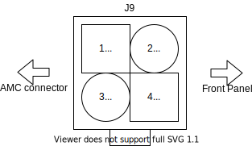
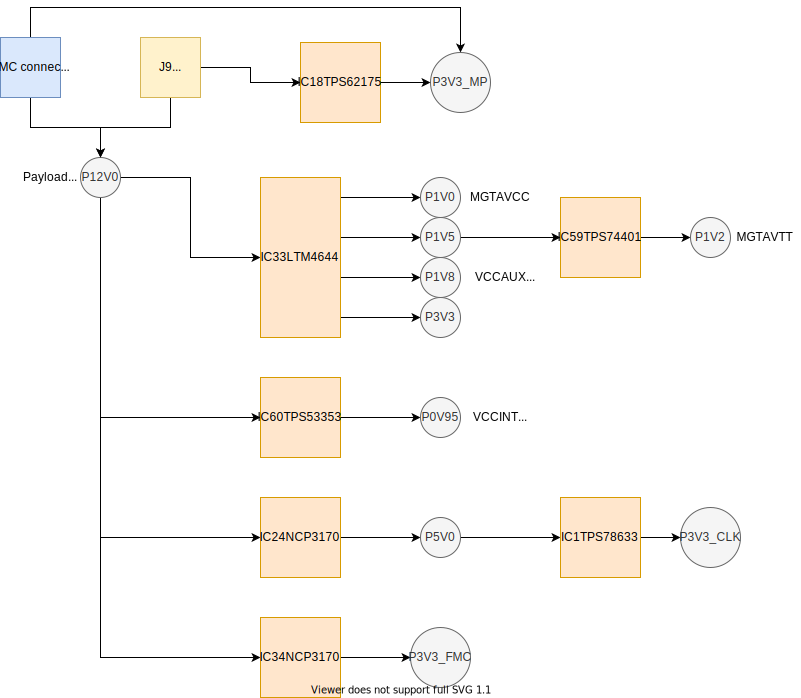
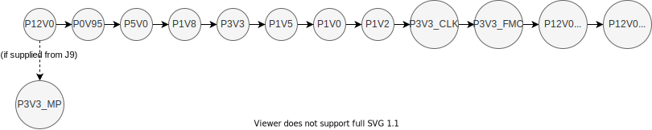

Power supply
============

The card can operate as stand alone devide, or plugged into a uTCA crate.

While working standalone  payload power (12 V) is supplied through Molex Connector (39-28-1043) - J9. The pinout is shown below. 3.3 V management power, used to supply MMC, is derived from payload power in this case. MMC then enables power converters which convert 12 V to lower voltages needed by the board.

    Power connector

When the card is inserted into the crate, both 12 V payload power and 3.3 V management power is supplied through AMC connector.
First, management power is supplied to the MMC, which can negotiate enabling payload power with the MCH if hotswap handle  is pushed in. After payload power is enabled, then MMC enables power converters which convert 12 V to lower voltages needed by the board.

Simplified power map is in figure below. All onboard voltages (exept P3V3\_MP) can be enabled by MMC.
There are two types of power distributors, LDOs and LTM chip - quad channel digital Pulse Width Modulated (PWM) step down (buck) controller. These power supplies require no configuration besides enabling. LTM chip and all LDOs have connected Power Good outputs which MMC reads to check if all power buses have the correct voltage.

Maximum board(AMC+RTM module) power consumption is estimated around 6A @ 12V.

.. note::
  Please note that power consumption heavily depends on FPGA configuration.

* Input voltage range: 10.8-13.2 [V]
* The board needs active cooling. Approx. 20CFM in 20 C air.

    Power supply block schematic

+-----------+------------------+------------------------------------+------------------------+
| **Name**  | **Voltage [V]**  | **Maximum predicted current [A]**  | **Current limit [A]**  |
+-----------+------------------+------------------------------------+------------------------+
| P0V95     | 0.95             | 12.0                               | 20                     |
+-----------+------------------+------------------------------------+------------------------+
| P1V0      | 1.0              | 3.0                                | 4                      |
+-----------+------------------+------------------------------------+------------------------+
| P1V2      | 1.2              | 0.6                                | 1                      |
+-----------+------------------+------------------------------------+------------------------+
| P1V5      | 1.5              | 3.1                                | 4                      |
+-----------+------------------+------------------------------------+------------------------+
| P1V8      | 1.8              | 3.7                                | 4                      |
+-----------+------------------+------------------------------------+------------------------+
| P3V3      | 3.3              | 3.8                                | 4                      |
+-----------+------------------+------------------------------------+------------------------+
| P3V3_MP   | 3.3              | 0.35                               | 0.5                    |
+-----------+------------------+------------------------------------+------------------------+
| P5V0      | 5.0              | 0.9                                | 2                      |
+-----------+------------------+------------------------------------+------------------------+

Power up sequence
-----------------

Power up sequence is controlled entirely by the MMC (apart from managent power). Sequence presented above is programmed into MMC and is done according to various on-board chip requirements.
RTM voltage is enabled only if RTM is present. Power down sequence is done in reverse.

Exar power converter
--------------------

Sayma AMC has pads for an alternative module with Exar power converter. Exar power converter was used in Sayma AMC v1.0 but had problems with voltage stability. For documentation on Exar and its configuration please consult `v1.0 documentation <https://github.com/m-labs/sinara/files/1770866/SaymaAMC.pdf>`_.
