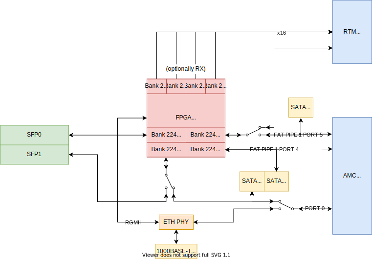

Routing
=======

This section contain several block schematics of Sayma AMC board. 

I/O connections
---------------

General block schematic below shows simplified connections between I/O and components. Some unused connectors were left out to improve readability of this schematic.

.. figure:: img/Sayma_AMC_general.svg

    General block schematic

Transceiver connections
-----------------------

Block schematic below shows connections to Multi-Gigabit Transceivers (MGT) of the FPGA. Switches symbolize connections that can be altered by placement of capacitors. Default connection is symbolized by switch position.

    MGT schematic with optional connections

Table below outlines connections to MGT ports of the FPGA. If there are two possibilities then the default one is listed first. RTM_MGT connections are TX only by default. 

+----------------------+---------------------+---------------------------------------------+
| **Transceiver MGT**  | **Direction**       | **Routed to**                               |
+----------------------+---------------------+---------------------------------------------+
| 0\_224               | RX & TX             | SFP0                                        |
+----------------------+---------------------+---------------------------------------------+
| 1\_224               | RX & TX             | PORT 0 or SFP1                              |
+----------------------+---------------------+---------------------------------------------+
| 2\_224               | RX & TX             | FAT PIPE 1 PORT 4 & SATA J16                |
+----------------------+---------------------+---------------------------------------------+
| 3\_224               | RX & TX             | RTM\_MGT or (FAT PIPE 1 PORT 5 & SATA J17)  |
+----------------------+---------------------+---------------------------------------------+
| 0\_225               | TX (optionally RX)  | RTM\_MGT                                    |
+----------------------+---------------------+---------------------------------------------+
| 1\_225               | TX (optionally RX)  | RTM\_MGT                                    |
+----------------------+---------------------+---------------------------------------------+
| 2\_225               | TX (optionally RX)  | RTM\_MGT                                    |
+----------------------+---------------------+---------------------------------------------+
| 3\_225               | TX (optionally RX)  | RTM\_MGT                                    |
+----------------------+---------------------+---------------------------------------------+
| 0\_226               | TX (optionally RX)  | RTM\_MGT                                    |
+----------------------+---------------------+---------------------------------------------+
| 1\_226               | TX (optionally RX)  | RTM\_MGT                                    |
+----------------------+---------------------+---------------------------------------------+
| 2\_226               | TX (optionally RX)  | RTM\_MGT                                    |
+----------------------+---------------------+---------------------------------------------+
| 3\_226               | TX (optionally RX)  | RTM\_MGT                                    |
+----------------------+---------------------+---------------------------------------------+
| 0\_227               | TX (optionally RX)  | RTM\_MGT                                    |
+----------------------+---------------------+---------------------------------------------+
| 1\_227               | TX (optionally RX)  | RTM\_MGT                                    |
+----------------------+---------------------+---------------------------------------------+
| 2\_227               | TX (optionally RX)  | RTM\_MGT                                    |
+----------------------+---------------------+---------------------------------------------+
| 3\_227               | TX (optionally RX)  | RTM\_MGT                                    |
+----------------------+---------------------+---------------------------------------------+
| 0\_228               | TX (optionally RX)  | RTM\_MGT                                    |
+----------------------+---------------------+---------------------------------------------+
| 1\_228               | TX (optionally RX)  | RTM\_MGT                                    |
+----------------------+---------------------+---------------------------------------------+
| 2\_228               | TX (optionally RX)  | RTM\_MGT                                    |
+----------------------+---------------------+---------------------------------------------+
| 3\_228               | TX (optionally RX)  | RTM\_MGT                                    |
+----------------------+---------------------+---------------------------------------------+
| 4\_228               | TX (optionally RX)  | RTM\_MGT                                    |
+----------------------+---------------------+---------------------------------------------+

.. todo:: Schematic with optional connections
