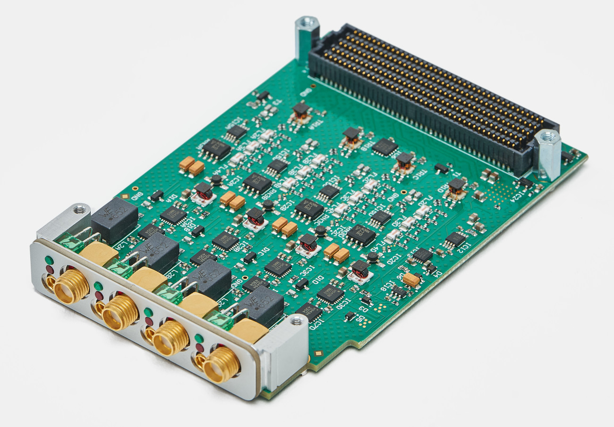

.. _afe:

RF Front-End Mezzanines
=======================

Mezzanines provide analogue front-ends (AFEs) for the DACs on Sayma. Same connectors as in FMC standard were used, but these AFEs are not compatible with FMC standard. Connectors are swapped between carrier and AFE to avoid insertion of incompatible FMC module.

There are several kinds of signals routed to AFE:

* 16 signals from the RTM FPGA - 3.3V LVCMOS voltage levels
* 8 pairs of LVDS signals from the RTM FPGA
* 12 pairs of LVDS signals from the AMC FPGA
* 2 I2C buses - 3.3V LVCMOS voltage levels
* GTP link from the RTM FPGA
* 4 differential analog channels from DAC
* differential reference clock

Each AFE is supplied with several analog and digital power supplies:

* P12V0A
* P6V0A
* P2V5F
* P3V3
* N12V0A
* N6V0A
* P3V3MP

See :ref:`afe_max_current_draw`.

TestMod
-------

Simple mezzanines designed for thermal and connectivity testing, and to serve as a template for other mezzanine designs.

.. TODO::
	image

Design repository is `here <https://github.com/sinara-hw/TestMod/>`__, production files are `here <https://github.com/sinara-hw/TestMod/releases>`__.

Design reporistory contains 4 projects that were used for prototyping different aspects of AFE design:

* **FMC Breakout** - breaks out all FMC HPC signals to FMC LPC (LPC signals) and VHDCI connector (HPC signals), with exception of gigabit links
* **TestMod_SEAx** - "the" Testmod

    * routes DAC differential signals to balun to SMA connectors
    * routes ADC signals to balun to ADC pins on FMC connector
    * routes MEZZ_IO signals to I2C GPIO extenders
    * routes LVDS signals to 30-pin connector
    * load can be manually enabled on each power supply rail on connector
    * has additional SMA and MMCX connectors to test trace impedance

* **TestMod_SEAx_Baseboard** - simpler version of TestMod_SEAx, with just SMA connectors for 8 analog signals and 30-pin connector for LVDS signals
* **Test_SEAx** - board with mating connector for TestMod_SEAx and TestMod_SEAx_Baseboard, which was used to check signal properties of the connector

BaseMod
-------

BaseMod is a base-band input/output mezzanine. Design repository is `here <https://github.com/sinara-hw/BaseMod>`__, production files are `here <https://github.com/sinara-hw/BaseMod/releases>`_.

Outputs
^^^^^^^

BaseMod provides four independent RF outputs, featuring:

* **Bandwidth**: 10MHz - 4GHz (upper frequency is limited by several different components)
* **Max output power**: ?dBm (limited by ?).
* **Output filters**: either 3 Mini-Circuits FV1206 series filters,	or a user-definable discrete 9-pole discrete-element filter using 0402 components.
* **Low phase noise amplifier**: Mini-Circuits ERA-4XSM+, 14.2dBm gain at 1GHz.
* **Digitally programmable attenuator**: HMC542BLP4E; 0dB to 31.dB in 0.5dB steps; controllable in real-time.
* **Fast, high-isolation RF switch**: HMC349LP4C; 67dB isolation at 1GHz; controllable in with real-time control.
* **Power detector**: AD8363ACPZ on switch "off" port for monitoring and power levelling.
* **Optional isolation of output grounds**: to avoid ground loops, achieved by fitting capacitors and washers.

Inputs
^^^^^^

BaseMod provides four inputs which are routed to LTC2324 ADC. ADC and input channel design are the same as in `Sampler EEM module <https://github.com/sinara-hw/Sampler>`__. 

* **Bandwidth**: DC-200kHz
* **Input ranges**: ±10mV, ±100mV, ±1V, ±10V
* **Fully differential inputs**: input signal routed to differential amplifier
* **Filters**: Common-mode and differential mode filtering of RF interference for optimum DC precision
* **Input protection**: diodes between each input and the supply rails for maximum ruggedness

MixMod
------

MixMod is a planned up-converting mezzanine, using an analogue IQ mixer to mix the input and output RF signals with a LO supplied by Sayma.

Design repository is `here <https://github.com/sinara-hw/MixMod>`__, though it wasn't updated for Sayma v2.0. Check issues in that repository for remaining problems in schematics. Initial specifications are `here <https://github.com/sinara-hw/sinara/issues/169#issue-211869922>`__.

MixMod should provide a single RF output between 2.5GHz and 3.5GHz, produced by mixing two DAC channels with a LO supplied by Sayma. Other than the IQ mixer, the output signal-chain is identical to BaseMod.

Mezzanines Mechanical Specification
-----------------------------------

* Board size

.. figure:: img/MEZZ.png

Mezzaninne dimensions

* Mounting holes: There are four mounting holes fi 2.7mm for M2.5 screws.

For exact mechanical drawings visit `TestMod repository <https://github.com/sinara-hw/TestMod/>`__, where source files are located.
