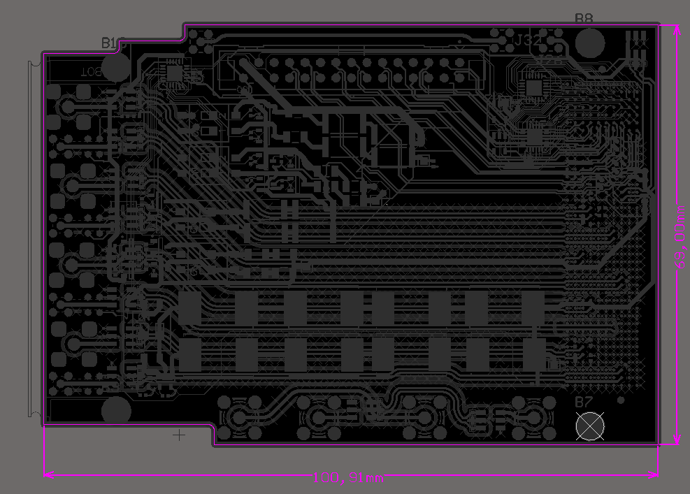

RF Front-End Mezzanines
=======================

Mezzanines providing analogue front-ends (AFEs) for the ADCs and DACs on
Sayma.

TestMod
-------

Simple mezzanine designed for thermal and connectivity testing, and to
serve as a template for other mezzanine designs.

.. TODO::
	image

Design files are `here <https://github.com/sinara-hw/TestMod/>`__
the schematic is
`here <https://github.com/sinara-hw/TestMod/releases>`__.

BaseMod
-------

BaseMod is a base-band input/output mezzanine. Design files are `here <https://github.com/sinara-hw/BaseMod>`__,
the schematic is `here <https://github.com/sinara-hw/BaseMod/releases>`_.

.. TODO::
	image

Outputs
^^^^^^^

BaseMod provides two independent RF outputs, featuring:

* **Bandwidth**: 10MHz - 4GHz (upper frequency is limited by several different components)
* **Max output power**: ?dBm (limited by ?).
* **Output filters**: either 3 Mini-Circuits FV1206 series filters,	or a user-definable discrete 9-pole discrete-element filter using 0402 components.
* **Low phase noise amplifier**: Mini-Circuits ERA-4XSM+, 14.2dBm gain at 1GHz.
* **Digitally programmable attenuator**: HMC542BLP4E; 0dB to 31.dB in 0.5dB steps; controllable in real-time.
* **Fast, high-isolation RF switch**: HMC349LP4C; 67dB isolation at 1GHz; controllable in with real-time control.
* **Power detector**: AD8363ACPZ on switch "off" port for monitoring and power levelling.
* **Optional isolation of output grounds**: to avoid ground loops, achieved by fitting capacitors and washers.

Inputs
^^^^^^

BaseMod provides two independent inputs, each of which can be configured (by component placement) as:

#. Direct feed to ADC via ADA4927-1 buffer for maximum bandwidth
#. Low-noise programmable gain instrumentation amplifier (AD8253) front-end

* **Bandwidth**: DC-300kHz
* **Input ranges**: ±0.1V, ±1V, ±10V
* **Fully differential inputs**: 100k between each input signal and ground and the circuit ground
* **Filters**: Common-mode and differential mode filtering of RF interference for optimum DC precision
* **Input protection**: diodes between each input and the supply rails for maximum ruggedness
* Supports both high-speed input directly coupled into a high-speed pre-amp, and low-frequency inputs using a variable-gain instrumentation amplifier (choice by component selection). Pull details from `#81 <https://github.com/m-labs/sinara/issues/81>`_
* Instrumentation amp: gain, filters, etc.

MixMod
------

MixMod is an up-converting mezzanine, using an analogue IQ mixer to mix the input and output RF signals with a LO supplied by Sayma.

The LO provided by Sayma should be a 3V3 PECL square-wave.

Design files are
`here <https://github.com/sinara-hw/MixMod>`__, schematics are `here <https://github.com/sinara-hw/MixMod/releases>`__

.. TODO
	image

Outputs
^^^^^^^

MixMod provides a single RF output between 2.5GHz and 3.5GHz, produced by mixing two DAC channels with a LO supplied by Sayma. Other than the IQ mixer, the output signal-chain is identical to BaseMod.

Inputs
^^^^^^

MixMod's two inputs can either be operated in baseband or downconversion mode (selectable by component choice). In baseband mode, the inputs function identically to BaseMod's. In downconversion mode, a single SMA input feeds the RF port on an IQ mixer to produce a pair of baseband signals, which then feed the two signal chains.

Mezzanines Mechanical Specification
-----------------------------------

* Board size

Mezzaninne dimensions

* Mounting holes: There are four mounting holes fi 2.7mm for M2.5 screws.
* SMA locations and pns
* Connectors

