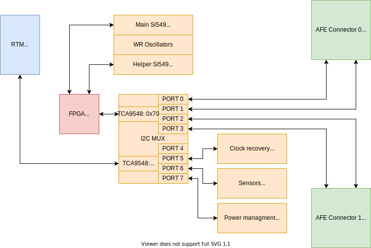

.. _rtm_i2c:

I2C connections
===============

The I2C MUX is made from two TCA9548 I2C multiplexers. In Sayma RTM there are two main I2C busses: IPMI\_I2C (from RTM connector) and RTM\_FPGA\_I2C. Each of them is connected to one multiplexer. Outputs are tied together, so masters (AMC board and FPGA) can access any of 7 I2C busses.

    I2C map with addresses in hex

