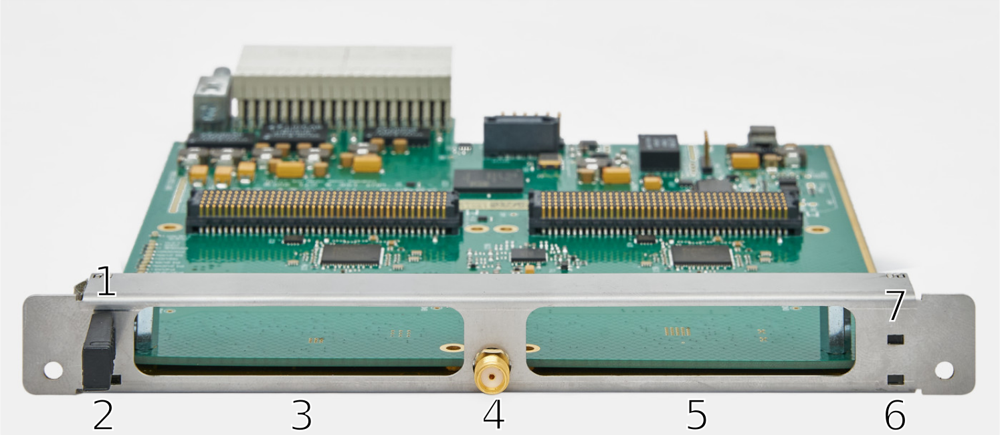
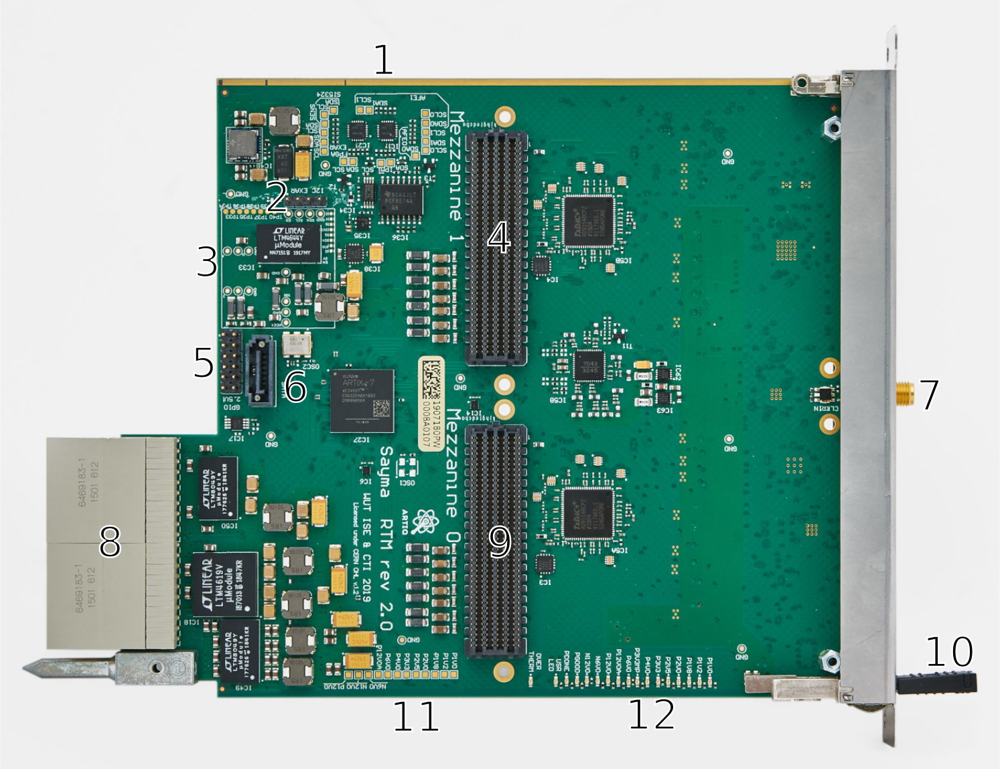
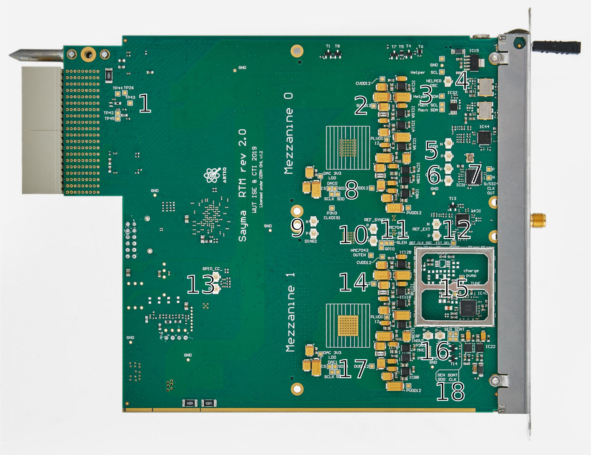
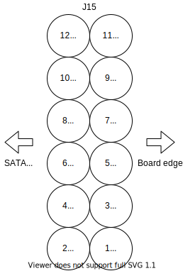

Board overview
==============

    Front view

+----+-------------------+-------------------------------------------------------------+
| #  | Item name         | Description                                                 |
+====+===================+=============================================================+
| 1  | Hotswap handle    | Handle used to disable and pull out the module.             |
+----+-------------------+-------------------------------------------------------------+
| 2  | Blue LED          | Indicates hot-swap state                                    |
+----+-------------------+-------------------------------------------------------------+
| 3  | Mezzanine 1 slot  | Slot for an AFE board                                       |
+----+-------------------+-------------------------------------------------------------+
| 4  | SMA clock input   | Connected to clock fanout input (see :ref:`rtm_clocking`).  |
+----+-------------------+-------------------------------------------------------------+
| 5  | Mezzanine 0 slot  | Slot for an AFE board                                       |
+----+-------------------+-------------------------------------------------------------+
| 6  | Green LED         | Indicates MMC activity.                                     |
+----+-------------------+-------------------------------------------------------------+
| 7  | Red LED           | Indicates power on.                                         |
+----+-------------------+-------------------------------------------------------------+

.. warning:: Due to a `bug in schematics <https://github.com/sinara-hw/Sayma_RTM/issues/105>`_ RTM is not hot-swappable on its own, only together with AMC board.

+--------+------------------------+-------------------------+-------------------------+
| LED    | On                     | Blinking                | Off                     |
+========+========================+=========================+=========================+
| Blue   | Ready for hot-swap     | Preparing for hot-swap  | Not ready for hot-swap  |
+--------+------------------------+-------------------------+-------------------------+
| Red    | Payload power enabled  | N/A                     | Payload power disabled  |
+--------+------------------------+-------------------------+-------------------------+
| Green  | MMC failure            | Normal operation        | MMC failure             |
+--------+------------------------+-------------------------+-------------------------+

    Top view

+----+-------------------------+--------------------------------------------------------------+
| #  | Item                    | Description                                                  |
+====+=========================+==============================================================+
| 1  | I2C testpoints          | Testpoints connected to all I2C buses. See  :ref:`rtm_i2c`.  |
+----+-------------------------+--------------------------------------------------------------+
| 2  | Exar programmer header  | Header used for programming an optional Exar power module    |
+----+-------------------------+--------------------------------------------------------------+
| 3  | Power module pins       | Pins for an alternative power module with Exar chip.         |
+----+-------------------------+--------------------------------------------------------------+
| 4  | Mezzanine 1 connector   | Connector for an AFE board. See :ref:`afe`.                  |
+----+-------------------------+--------------------------------------------------------------+
| 5  | GPIO header             | See :ref:`header` for pinout.                                |
+----+-------------------------+--------------------------------------------------------------+
| 6  | SATA connector          | Connected to the FPGA                                        |
+----+-------------------------+--------------------------------------------------------------+
| 7  | SMA connector           | External clock connection                                    |
+----+-------------------------+--------------------------------------------------------------+
| 8  | RTM connector           | Connects the board to Sayma AMC                              |
+----+-------------------------+--------------------------------------------------------------+
| 9  | Mezzanine 0 connector   | Connector for an AFE board. See :ref:`afe`.                  |
+----+-------------------------+--------------------------------------------------------------+
| 10 | Hotswap handle          | Handle used to disable and pull out the module.              |
+----+-------------------------+--------------------------------------------------------------+
| 11 | Power testpoints        | Testpoints connected to all power supplies                   |
+----+-------------------------+--------------------------------------------------------------+
| 12 | LEDs                    | LEDs indicating board status                                 |
+----+-------------------------+--------------------------------------------------------------+

+------------+-----------------------------+--------------------------------------------------+
| LED        | On                          | Off                                              |
+============+=============================+==================================================+
| PGOOD      | Power good signal           | Some power supply exceeds ±10% of nominal value  |
+------------+-----------------------------+--------------------------------------------------+
| PDONE      | FPGA programming done       | FPGA is not programmed                           |
+------------+-----------------------------+--------------------------------------------------+
| USR LED    | User defined                | User defined (connected to the FPGA)             |
+------------+-----------------------------+--------------------------------------------------+
| OVERTHERM  | Temperature limit exceeded  | Board temperature within limits                  |
+------------+-----------------------------+--------------------------------------------------+

Power supply LEDs are marked as follows:

 * P - positive voltage, N - negative voltage
 * integer part of the voltage
 * V
 * fractional part of the voltage
 * optional suffix: 
    
    * MP - management power
    * A - analog power supply

E.g. P12V0A - 12,0 V analog power supply.

    Bottom view

+----+----------------------------+----------------------------------------------------------------+
| #  | Item name                  | Description                                                    |
+====+============================+================================================================+
| 1  | IC18 testpoints            | See schematics and LTM4619 datasheet for more information.     |
+----+----------------------------+----------------------------------------------------------------+
| 2  | DAC0 supply testpoints     | DAC0 power supplies                                            |
+----+----------------------------+----------------------------------------------------------------+
| 3  | WR I2C testpoints          | Testpoints of WR Main and Helper oscillators I2C buses         |
+----+----------------------------+----------------------------------------------------------------+
| 4  | u.FL connector             | WR Helper oscillator output (N/C by default)                   |
+----+----------------------------+----------------------------------------------------------------+
| 5  | u.FL connectors            | IC44 clock fanout output (see :ref:`rtm_clocking`).            |
+----+----------------------------+----------------------------------------------------------------+
| 6  | u.FL connectors            | Optional Si5324 (IC31) clock input (see :ref:`rtm_clocking`).  |
+----+----------------------------+----------------------------------------------------------------+
| 7  | Si5324 CLK OUT testpoints  | Testpoints connected to Si5324 (IC31) clock output             |
+----+----------------------------+----------------------------------------------------------------+
| 8  | DAC0 SPI testpoints        | Testpoints connected to SPI port of DAC0 (IC5A)                |
+----+----------------------------+----------------------------------------------------------------+
| 9  | u.FL connectors            | IC58 sysref clock output (see :ref:`rtm_clocking`).            |
+----+----------------------------+----------------------------------------------------------------+
| 10 | u.FL connectors            | IC58 RF SYNC IN clock input (see :ref:`rtm_clocking`).         |
+----+----------------------------+----------------------------------------------------------------+
| 11 | HMC7043 SPI testpoints     | Testpoints connected to SPI port of HMC7043 (IC58)             |
+----+----------------------------+----------------------------------------------------------------+
| 12 | u.FL connectors            | IC46 clock fanout output (see :ref:`rtm_clocking`).            |
+----+----------------------------+----------------------------------------------------------------+
| 13 | u.FL connectors            | Connectors connected to clock capable pins of FPGA bank 15     |
+----+----------------------------+----------------------------------------------------------------+
| 14 | DAC1 supply testpoints     | DAC1 power supplies                                            |
+----+----------------------------+----------------------------------------------------------------+
| 15 | HMC830 cage                | Metal cage with HMC830 and associated components inside        |
+----+----------------------------+----------------------------------------------------------------+
| 16 | u.FL connectors            | Optional HMC830 RF output (N/C by default)                     |
+----+----------------------------+----------------------------------------------------------------+
| 17 | DAC1 SPI testpoints        | Testpoints connected to SPI port of DAC1 (IC5B)                |
+----+----------------------------+----------------------------------------------------------------+
| 18 | HMC803 SPI testpoints      | Testpoints connected to SPI port of HMC830 (IC40)              |
+----+----------------------------+----------------------------------------------------------------+

.. _header:

GPIO header pinout
------------------

    GPIO - call out 5 on top view
    
Pins 1-10 show which FPGA pin is connected to the header pin.

