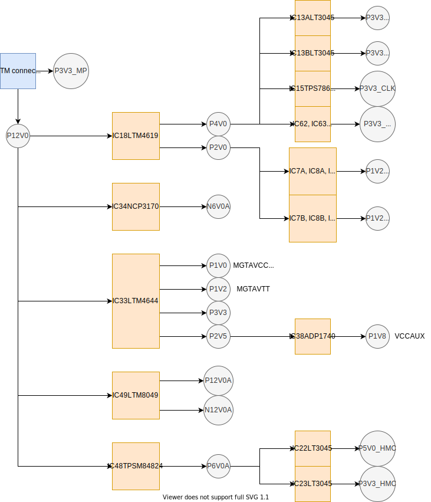

Power supply
============

Sayma RTM is intended to operate connected to Sayma AMC card. When the card is inserted to the Sayma AMC, 12V (4 power lines) and 3.3\_MP (1 line) are supplied through RTM connector. MMC on Sayma AMC controls supply of both voltages.

12V supply is converted to lower voltages and negative voltages. Simplified power map is shown in a figure below. Maximum board(AMC+RTM module) power consumption is estimated to 6A @ 12V.

.. Note::
    Power consumption mostly depends on FPGA configuration.

* Input voltage range: 10.8-13.2 [V]
* The board needs active cooling. Approx. 20CFM in 20°C air.

Power configuration
-------------------

Power map
^^^^^^^^^

    Power map

.. _afe_max_current_draw:

Maximum power draw for each Mezzaninne
--------------------------------------

+----------------+---------------+
| Power rail[V]  | Current [mA]  |
+----------------+---------------+
| +12            | 400           |
+----------------+---------------+
| -12            | 10            |
+----------------+---------------+
| +6             | 3000          |
+----------------+---------------+
| -6             | 200           |
+----------------+---------------+
| +3.3           | 1500          |
+----------------+---------------+
| +3.3_MP        | 5             |
+----------------+---------------+
| +2.5           | 100           |
+----------------+---------------+

