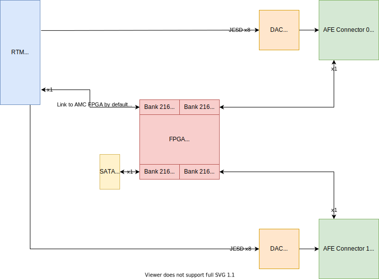

Routing
=======

This section contain several block schematics of Sayma RTM board.

I/O connections
---------------

General block schematic below shows simplified connections between I/O and components. Some unused connectors were left out to improve readability of this schematic. Front panel connectors (green) and back connectors (blue) are arranged in the same order as in the PCB.

    General block schematic

Transceiver connections
-----------------------

Block schematic below shows connections of Multi-Gigabit Transceivers (MGT).

    MGT connections

