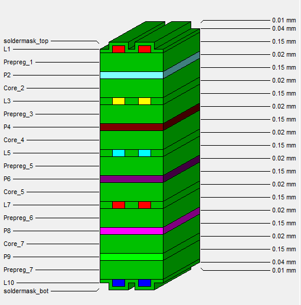

PCB technical information
=========================

`Manufacturing files <https://github.com/sinara-hw/Sayma_RTM/releases>`_

Stackup:

+--------+-------------+-------------------------------------------------------------------------------------------+
| Layer  | Copper [um] | Function                                                                                  |
+========+=============+===========================================================================================+
| L1     | 36          | polygons, short traces and analog signals between DAC and connectors                      |
+--------+-------------+-------------------------------------------------------------------------------------------+
| P2     | 18          | GND                                                                                       |
+--------+-------------+-------------------------------------------------------------------------------------------+
| L3     | 18          | high speed signals, LVDS, GTX, clocks                                                     |
+--------+-------------+-------------------------------------------------------------------------------------------+
| P4     | 18          | GND                                                                                       |
+--------+-------------+-------------------------------------------------------------------------------------------+
| L5     | 18          | high speed, LVDS, GTX, clocks, vertical slow control                                      |
+--------+-------------+-------------------------------------------------------------------------------------------+
| P6     | 18          | GND                                                                                       |
+--------+-------------+-------------------------------------------------------------------------------------------+
| L7     | 18          | I2C, SPI, mezzanine IOs,                                                                  |
|        |             | status, LED, power polygons                                                               |
+--------+-------------+-------------------------------------------------------------------------------------------+
| P8     | 18          | GND                                                                                       |
+--------+-------------+-------------------------------------------------------------------------------------------+
| P9     | 18          | split power plane                                                                         |
+--------+-------------+-------------------------------------------------------------------------------------------+
| L10    | 36          | short signal layers (ADCs), mainly polygons and short traces (EMI mitigation)             |
+--------+-------------+-------------------------------------------------------------------------------------------+

The total height of the board is: 1.59 mm. Dielectric is a standard FR408.

    SAYMA RTM stackup
	
.. note:: 
	The thickness of copper in Figure 17 is 0.04mm and 0.02mm is due to approximation. In fact it is 0.036mm and 0.018mm. See table above.
